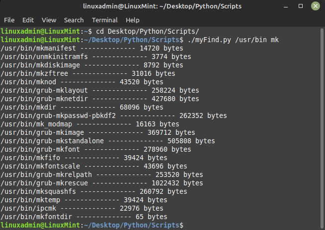
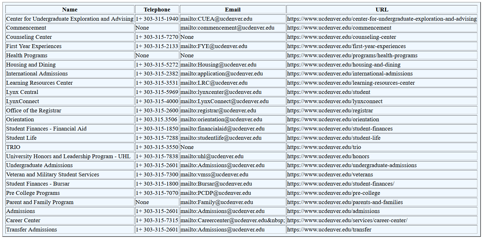
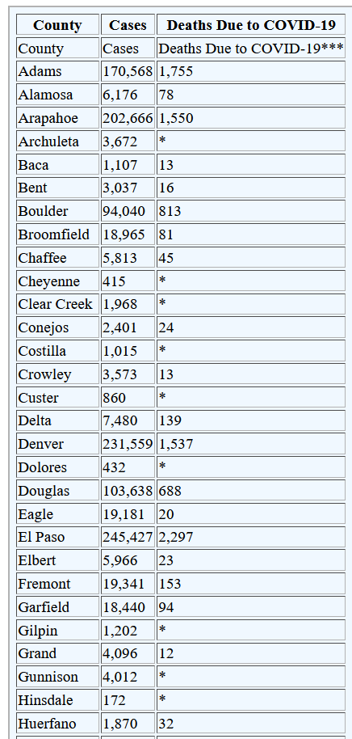

# Scripts
## myFind.py
myFind.py is a python script built to search files in unix systems. It will look for certain words or character within the whole system or specific folder. It also proves the size of the size of the file.

# Word Cloud from News Articles
Word Clouds are used in various settings to visually represent the most frequently occurring words related to a main topic. In this script, I use the NewsAPI to collect titles from news articles and then construct a WordCloud based on them.

# Webscraping

## UCdenverDepts.py
This code aims at scrapping ["Name","Telephone","Email","URL"] from the UC Denver main home page. It takes this information and forms a table. Making easier to find the information according to the department. 

## CovidData.py
CovidData.py takes Covid Data from the state of colorado website and breaks it down in a HTML table.

